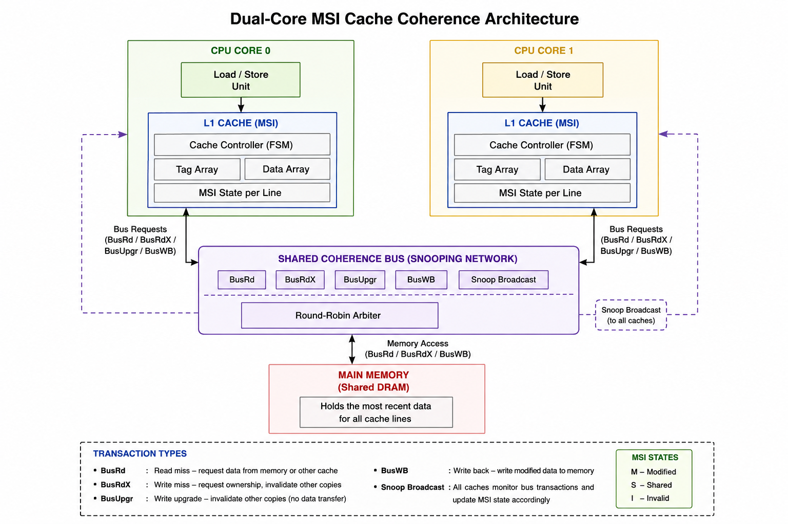
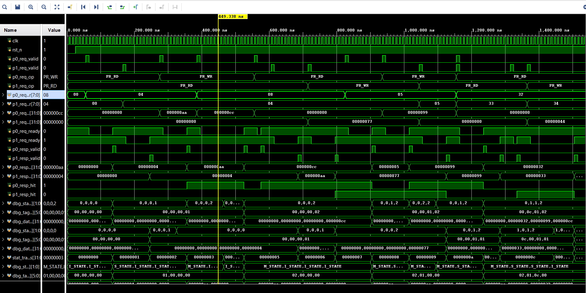

# Dual-Core Cache Coherence System — MSI Protocol (SystemVerilog)

A snooping-bus **MSI cache-coherence** implementation for a dual-core system,
built in SystemVerilog with a fully self-checking testbench. Simulated and
verified in **Xilinx Vivado Simulator (XSim) 2020.2**.

> 51/51 checks passed · 0 coherence-invariant violations · 100% functional coverage
> across all state-transition, operation, and bus-command axes.

---

## Overview

This project implements a classic 3-state **MSI (Modified / Shared / Invalid)**
snooping coherence protocol between two independent L1 caches sharing a single
memory bus. It covers the full protocol lifecycle:

- Cold read/write misses (`BusRd` / `BusRdX`)
- Shared-read fan-out with no unnecessary invalidation
- Write-hit upgrades (`BusUpgr`, S→M)
- Dirty-line eviction with implicit writeback (`BusWB`)
- Remote snoop-induced downgrade (M→S) and invalidation (→I)
- Round-robin bus arbitration under true concurrent contention

It's verified with a self-checking testbench (not just visual waveform
inspection) — every scenario asserts expected state/data/counters in-sim and
prints `[PASS]`/`[FAIL]`, plus a background monitor that checks the MSI
mutual-exclusion invariant on **every clock cycle** of the run.

## Architecture



- **Cache**: 4-line direct-mapped, 32-bit data, 8-bit address
  (`idx = addr[1:0]`, `tag = addr[7:2]`) — resizable via `msi_pkg.sv`.
- **Bus**: single shared bus, one transaction at a time, round-robin
  arbitration when both cores request simultaneously.

## Repository structure

| File                    | Description                                                     |
|--------------------------|-------------------------------------------------------------------|
| `msi_pkg.sv`             | Shared types: MSI states (I/S/M), bus commands, parameters       |
| `main_memory.sv`         | Single-ported shared main memory                                 |
| `cache_core.sv`          | Per-core direct-mapped L1 cache + MSI FSM + snoop responder       |
| `coherence_bus.sv`       | Snooping bus arbiter (round-robin) + memory tie-in                |
| `dual_core_msi_top.sv`   | Top level: 2× `cache_core` + `coherence_bus`                     |
| `tb_dual_core_msi.sv`    | Self-checking testbench (13 scenarios, 51 checks, coverage report)|
| `msi_covergroups.sv`     | *(optional)* native SystemVerilog `covergroup`s for Vivado's Coverage Report GUI |
| `diagrams/architecture.svg` | Architecture diagram (embedded above)                          |
| `waveforms/`             | Simulation waveform screenshot(s) — see below                    |
| `logs/`                  | Vivado TCL console / simulation transcript — see below            |

## Running it in Vivado

1. Create a new project (or open an existing one) and add all `.sv` files
   above as **simulation sources**.
2. **Set the correct simulation top** — this matters, since Vivado can
   otherwise pick `dual_core_msi_top` (the DUT) instead of the testbench,
   which will simulate with everything undriven:
   ```tcl
   set_property top tb_dual_core_msi [get_filesets sim_1]
   update_compile_order -fileset sim_1
   ```
   (Or in the GUI: Sources → Simulation Sources → right-click
   `tb_dual_core_msi` → **Set as Top**.)
3. Run to completion rather than a fixed time window:
   ```tcl
   launch_simulation
   run -all
   ```
4. You should see the full `[PASS]` transcript ending in:
   ```
   RESULTS: 51 PASSED, 0 FAILED, 0 INVARIANT VIOLATIONS
   STATUS: ALL TESTS PASSED - MSI coherence verified.
   ```

### Optional: native Vivado functional coverage

`msi_covergroups.sv` adds real `covergroup`/`coverpoint` constructs (state
transitions + operation outcomes) via a `bind` statement, so it attaches
automatically to both cores without touching any other file. To use it:

1. Add `msi_covergroups.sv` to your simulation sources.
2. Flow Navigator → Simulation → Settings → Simulation → enable **Coverage**.
3. Run as normal, then open **Coverage → Open Coverage Report**.

The testbench also has its own built-in, simulator-agnostic coverage tracker
(state transitions, operation hit/miss, bus commands) that prints a report
directly to the transcript — no coverage database needed, and it's what
produced the 100%-coverage result quoted above.

### Also runs under Icarus Verilog

Every file except `msi_covergroups.sv` (which uses `covergroup`, unsupported
by Icarus) also compiles and runs cleanly under open-source Icarus Verilog,
if you want a quick sanity check outside Vivado:

```bash
iverilog -g2012 -o sim.vvp msi_pkg.sv main_memory.sv cache_core.sv \
         coherence_bus.sv dual_core_msi_top.sv tb_dual_core_msi.sv
vvp sim.vvp
```

## Simulation waveform




## Simulation log

Full Vivado TCL console output / simulation transcript from a complete
`run -all`, showing every `[PASS]` check and the final coverage report:

📄 [`logs/vivado_sim_log.txt`](logs/vivado_sim_log.txt)

<details>
<summary>Click to expand a short excerpt</summary>

```
================================================================
 Dual-Core MSI Cache Coherence -- Self-Checking Testbench
================================================================
-- Scenario 0: Reset state --
  [PASS] core0 line0 reset state state=I
  ...
================================================================
 RESULTS: 51 PASSED, 0 FAILED, 0 INVARIANT VIOLATIONS
 STATUS: ALL TESTS PASSED - MSI coherence verified.
================================================================
```

</details>

## What the testbench verifies

1. Reset state — all lines start Invalid.
2. Cold read miss (I→S).
3. Shared read — second core reading the same line doesn't invalidate the first.
4. Write hit / upgrade (S→M via `BusUpgr`) — invalidates the remote sharer.
5. Write miss with dirty-line eviction — implicit `BusWB` writeback, checked
   directly against the memory array.
6. Cache hit accounting — re-reading a line hits with zero new bus transactions.
7. Remote read of a Modified line — forces writeback + M→S downgrade.
8. Bus transaction count sanity check against the hand-traced protocol trace.
9. True concurrent contention — both cores request in the same cycle;
   round-robin arbiter serializes them correctly.
10. Coverage-closing scenarios — added after the coverage report revealed two
    untouched operation bins, closing them to reach 100%.
11. Background MSI invariant monitor — runs every cycle of the whole
    simulation, flags a violation if one core is `M` while the other isn't `I`.

## Functional coverage results

| Axis                        | Bins   | Covered |
|------------------------------|--------|---------|
| MSI state transitions         | 6      | 6 (100%) |
| Processor operations (RD/WR × HIT/MISS × core) | 8 | 8 (100%) |
| Bus command types              | 4      | 4 (100%) |

## Notes / lessons learned

- A true same-cycle-contention test surfaced a real RTL race: the bus's
  memory-write logic wasn't gated to its `BMEM` state, so back-to-back
  transactions with *different* snoop outcomes could let a stale
  snoop-result register leak through and corrupt an unrelated memory
  address. Fixed in `coherence_bus.sv`.
- The functional coverage report caught two operation bins the original
  directed tests never exercised (`core1:RD:HIT`, `core1:WR:MISS`) — a good
  concrete example of coverage doing its job.
